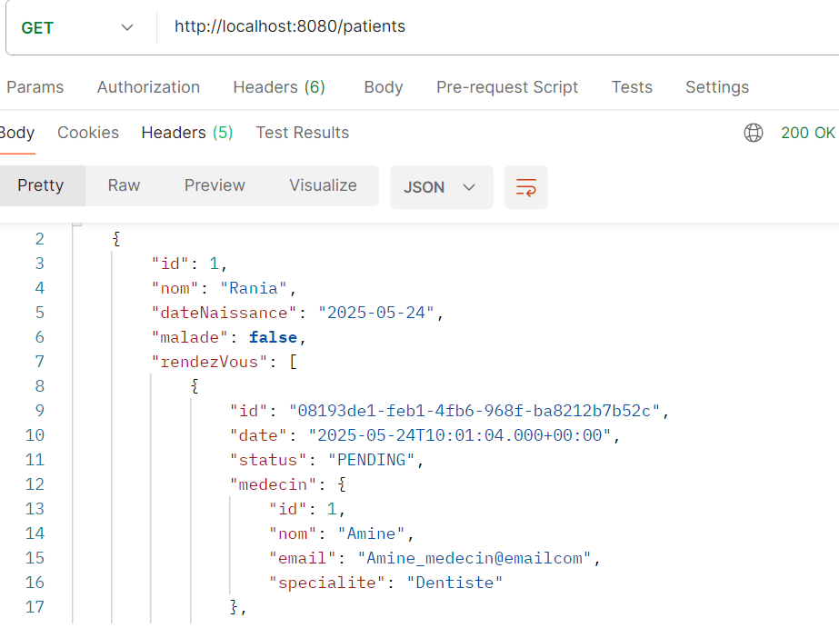
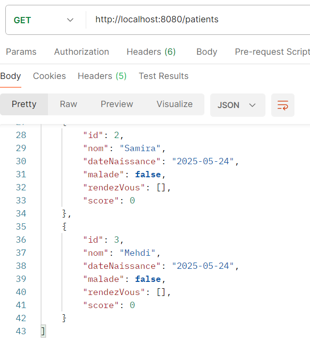
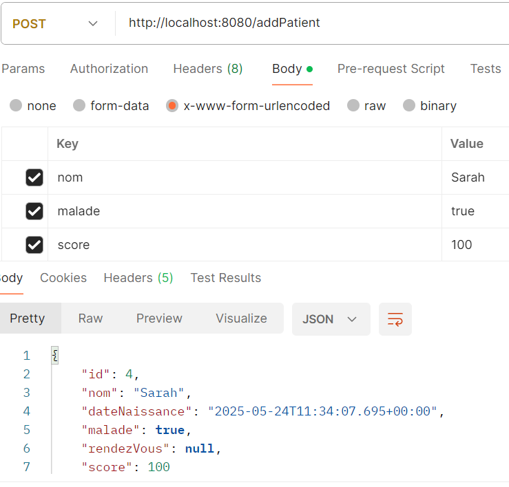
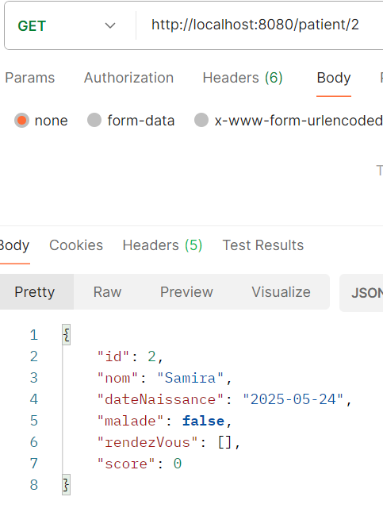
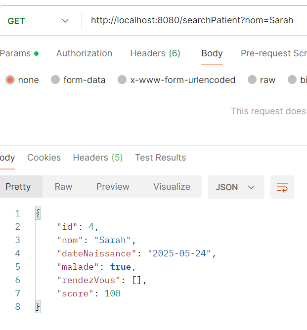
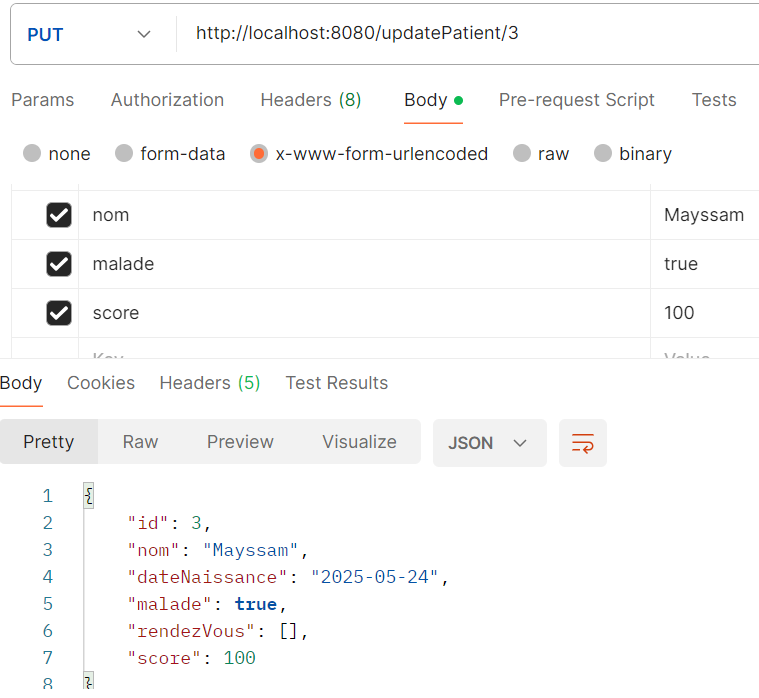
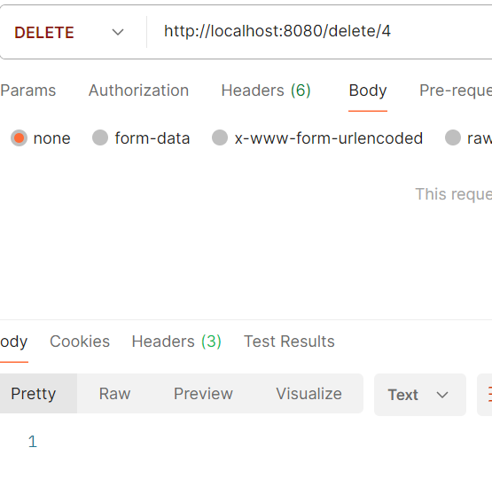

# Hospital Management Spring Boot

## Description du projet

Ce projet est une application de gestion hospitalière développée avec **Spring Boot**. Il permet de gérer les entités suivantes :

- **Patients**
- **Médecins**
- **Rendez-vous**
- **Consultations**

L'application expose une API RESTful pour effectuer des opérations CRUD sur ces entités. Elle utilise **MySQL** comme base de données relationnelle.

## Objectifs pédagogiques

Ce projet a été réalisé dans le cadre du module **Systèmes Distribués** du Master SDIA. Les objectifs pédagogiques incluent :

1. **Installation et configuration** de l'environnement de développement avec **IntelliJ IDEA Ultimate**.
2. **Création d'un projet Spring Boot** via Spring Initializr avec les dépendances :
   - Spring Web
   - Spring Data JPA
   - Lombok
   - H2 Database (pour les tests initiaux)
3. **Développement d'entités JPA** pour modéliser les données.
4. **Configuration de l'unité de persistance** dans le fichier `application.properties`.
5. **Création de repositories** en utilisant Spring Data JPA.
6. **Implémentation de services RESTful** pour gérer les opérations CRUD.
7. **Migration de la base de données** de H2 vers MySQL.
8. **Intégration des concepts avancés** tels que la gestion des utilisateurs et des rôles, inspirés des vidéos pédagogiques fournies.

## Architecture du projet

```
hospital-management-spring/
├── src/
│   ├── main/
│   │   ├── java/
│   │   │   └── com/
│   │   │       └── fsm/
│   │   │           └── hospital/
│   │   │               ├── entities/
│   │   │               │   ├── Patient.java
│   │   │               │   ├── Medecin.java
│   │   │               │   ├── RendezVous.java
│   │   │               │   └── Consultation.java
│   │   │               ├── repositories/
│   │   │               │   ├── PatientRepository.java
│   │   │               │   ├── MedecinRepository.java
│   │   │               │   ├── RendezVousRepository.java
│   │   │               │   └── ConsultationRepository.java
│   │   │               ├── service/
│   │   │               │   ├── IHospitalService.java
│   │   │               │   └── HospitalServiceImpl.java
│   │   │               ├── web/
│   │   │               │   └── PatientRestController.java
│   │   │               └── HospitalApplication.java
│   │   └── resources/
│   │       └── application.properties
├── pom.xml
└── README.md
```

## Modèle de données

### Entité Patient

```java
@Entity
public class Patient {
    @Id @GeneratedValue(strategy = GenerationType.IDENTITY)
    private Long id;
    private String nom;
    private Date dateNaissance;
    private boolean malade;
    private int score;
    // Getters and Setters
}
```

### Autres entités

- **Medecin** : nom, email, spécialité
- **RendezVous** : date, statut, associations patient et médecin
- **Consultation** : date de consultation, rapport, lien avec un rendez-vous

## Configuration de la base de données

Le fichier `application.properties` est configuré comme suit :

```properties
spring.application.name=hospital
server.port=8080

spring.datasource.url=jdbc:mysql://localhost:3306/HOSPITAL_DB?createDatabaseIfNotExist=true
spring.datasource.username=root
spring.datasource.password=
spring.jpa.hibernate.ddl-auto=create
spring.jpa.properties.hibernate.dialect=org.hibernate.dialect.MySQL8Dialect
spring.jpa.show-sql=true
```

Assurez-vous que **XAMPP** est lancé avec **MySQL** et **Apache** démarrés avant d'exécuter l'application.

## API REST - Endpoints

### Patient

| Méthode | Endpoint              | Description                        |
|---------|-----------------------|------------------------------------|
| GET     | `/patients`           | Récupérer tous les patients        |
| GET     | `/patient/{id}`       | Récupérer un patient par ID        |
| POST    | `/addPatient`         | Ajouter un nouveau patient         |
| GET     | `/searchPatient`      | Chercher un patient par nom        |
| PUT     | `/updatePatient/{id}` | Modifier les informations d'un patient |
| DELETE  | `/delete/{id}`        | Supprimer un patient               |

### Exemple de requête POST `/addPatient`

```
POST http://localhost:8080/addPatient
Params:
  nom = Sarah
  malade = true
  score = 100
```

## Initialisation des données

À chaque démarrage de l'application, des données sont initialisées via `CommandLineRunner` :

- Création de 3 patients : Rania, Samira, Mehdi
- Création de 3 médecins avec des spécialités aléatoires
- Création d'un rendez-vous entre un patient et un médecin
- Création d'une consultation associée au rendez-vous

## Migration de H2 vers MySQL

Initialement, la base de données était en mémoire via **H2**. Elle a été migrée vers **MySQL**, et configurée dans `application.properties` avec `createDatabaseIfNotExist=true`.

## Captures d'écran

### 1. Consulter tous les patients




### 2. Ajouter un patient



### 3. Consulter un patient par ID



### 4. Rechercher un patient par nom



### 5. Mettre à jour un patient



### 6. Supprimer un patient




## Références

Le projet s'inspire des vidéos pédagogiques suivantes :

- [Partie 1 : Patients, Médecins, Rendez-vous](https://www.youtube.com/watch?v=Kfv_7m8INlU)
- [Partie 2 : Consultations, Sécurité, Utilisateurs](https://www.youtube.com/watch?v=s6p2dE3qrsU)

## Auteur

- **Nom** : *Sehait Mayssam*
- **GitHub** : [github.com/MayssamSe/hospital-management-spring](https://github.com/MayssamSe/hospital-management-spring)
